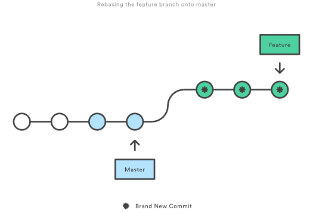

# Git Branching and Merging

---

## Last Time...

@ul
- Development is being migrated away from internally hosted Team Foundation Servers to Azure DevOps
- On TFS we are using TFS Version Control, Azure DevOps uses Git for version control
- Last time we looked at basic Git commands, today we're looking at how we'll use it in Computershare
@ulend

---

## Outline

@ul
- A quick overview of branching and merging
- Different branching models
- What we're using in Computershare
- Trying it out in Git
@ulend

---

## Branching

@ul
- Git branches are more lightweight than in other version control systems
- They can be be quickly created so are useful in day to day workflows
- A git branch represents an independent line of development and can exist entirely on a local repository
@ulend

---

## Merging and Rebasing

@ul
- Both `git merge` and `git rebase` solve the same problem, how to integrate changes from one branch into another
- `git merge` is a non-destructive operation that creates a new commit on your branch merging in the merge branch
- `git rebase` moves the entirety of your branch to the end of the merge branch and creates brand new commits for each commit in your branch
@ulend

---

## Git Branch


---

## Git Merge


---

## Git Rebase



---

## Working as a Team

@ul
- Using branches and merging we can develop on the same code in parallel and merge our changes
- Git allows a wide variety of branching strategies and workflows. Many different models of how to work together including Git Flow, GitHub Flow and GitLab Flow
- Global Development is going to use GitLab Flow, using environment branches and a merge changes policy for projects on Azure Devops
@ulend

---

## GitLab Flow

@ul
- GitLab flow has a single Master branch into which all development work is merged
- As we do not deploy all changes immediately we will have at least one production branch to release features
- Some projects may need multiple production branches for different environments
- Rebasing can be used to tidy commits prior to merging, but no rebasing onto master!
@ulend

---

## Try It Yourself

Taking the repository we cloned and worked with last time:

```sh
> git checkout master
> git pull --rebase origin master
> git checkout <branch>
> git rebase master
> git push origin
```

These commands will get the latest version of master, and rebase your changes onto it ready to merge them into master

---

## Try It Yourself

- Open up [https://dev.azure.com/CTS-GD/Scratch/_git/gitdemo](https://dev.azure.com/CTS-GD/Scratch/_git/gitdemo) and take a look at your branch
- Now go to **Pull requests** to create a pull request from your branch into the **master** branch
- Enter a title and description, and pick some people to review your change

---

## Try It Yourself

- Now you should see your pull request, alongside the other pull requests people have created
- Go into other pull requests and comment on the changes
- When you are happy with your change and the comments a pull request can be completed or abandoned
- But what happens if someone has completed their pull request ahead of yours?
